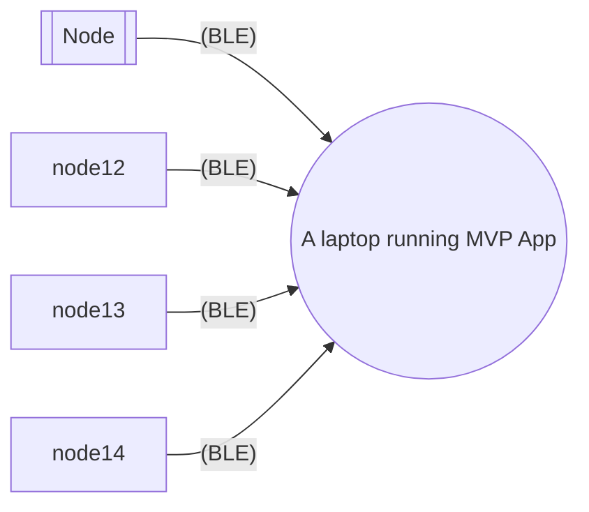
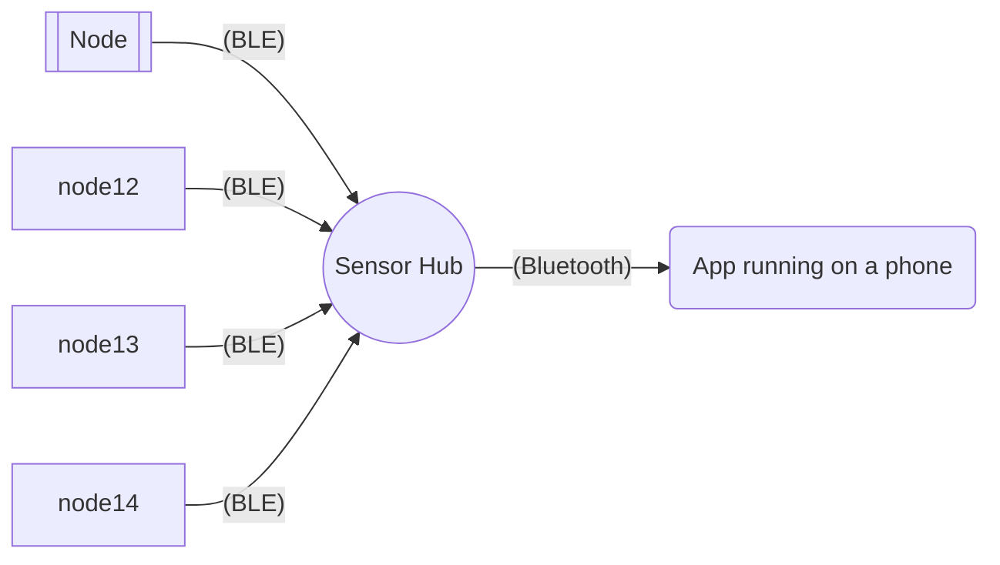
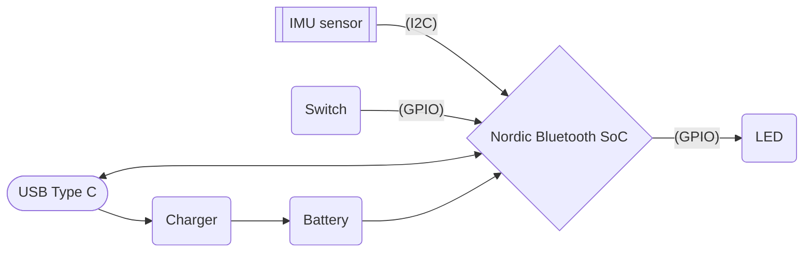
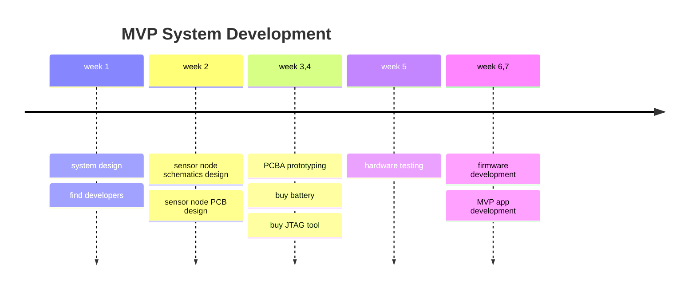
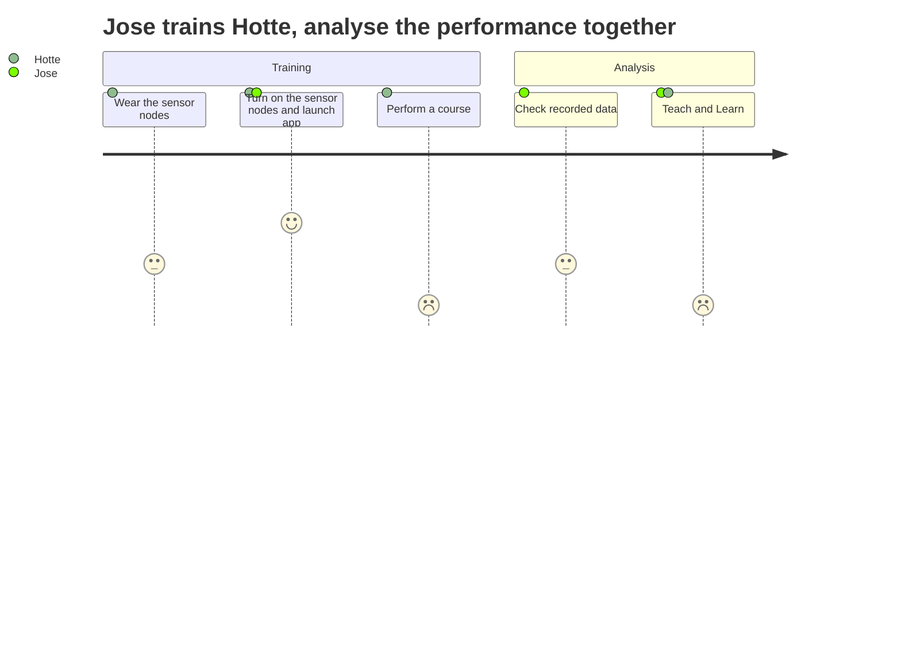

# Motion Sensor System Requriements

> This document is provisional only.
> It will be continueously updated with the development progress.

## System Overview

### MVP System

An MVP system hardware is a collection of 4 Sensor Nodes and 1 MVP App

### Actual System

MVP system above is just for demonstrating the functions and capabilities. The actual system will not need a laptop, instead it will be usable from both laptops and mobile phnes.

### Sensor Node Hardware

item | example | description
-----|---------|------------
Nordic Bluetooth SoC | [nRF52832](https://www.lcsc.com/product-detail/RF-Transceiver-ICs_Nordic-Semicon-NRF52832-QFAA-R_C77540.html) | A microcontroller with both Bluetooth and BLE capability. Note that some SoCs are only one of Bluetooth and BLE capable. We need both in the MVP development stage. Arduino compatibility is important in MVP development phase, to reduce development cost and time. To reduce the hardware design cost, using a pre-built Nordic module like [Ublox BMD380](https://www.digikey.com/en/products/detail/u-blox/bmd-380-a-r/12759179) can also be an option.
IMU sensor | [MPU6050](https://www.lcsc.com/product-detail/Accelerometers_TDK-InvenSense-MPU-6050_C24112.html) | There are many different IMU sensors with different number of axis, accuracy, and power profile. We need the most common one with good community software support to reduce the development cost.
USB Type C | | Provides easier programmming / debugging in the development. It is also for recharging the battery.
Charger | [WS4518](https://www.lcsc.com/product-detail/Battery-Management_WILLSEMI-Will-Semicon-WS4518D-6-TR_C910991.html) | Any common 1-cell Li-ion/po battery charging chip with low quiescent current.
Battery | [Sparkfun 40mAh battery](https://www.digikey.com/en/products/detail/sparkfun-electronics/PRT-13852/6605202?s=N4IgTCBcDaIIwFYBsAOAtHALATiWgcgCIgC6AvkA) | Any small Li-ion or Li-po battery with small form factor can be used.
Switch | | One or two toggle button switches. With a single button, long-press can be power turn on/off, short click or double click can be used for paring / identifying itself from the App.
LED | | A single-color or 3-color LED for indication the node status

### MVP Development Breakdown

## TL;DR

### Glossary

* **Sensor Node** : A small sensor device that
  - can be attached to a special part of human body, e.g. hear ankle hinge.
  - has IMU sensor(s).
  - has a battery, rechargable or non-rechargable
  - has wireless communication capability, e.g. BLE (Bluetooth Low Energy)
* **Training** : A session of physical training
* **App** : A mobile phone application or computer application with GUI (Graphical User Interface)
* **MVP App** : An application running on a laptop, with basic data collection functions like **App** does

### User Story

